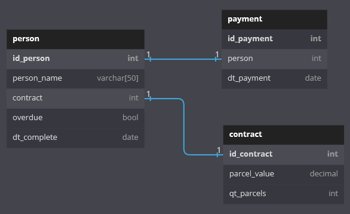

# Banco Central de Financiamentos :desktop_computer:

##### Questão 3 da Avaliação Técnica do Programa de Desenvolvedores Trainees da L2Code

#

#


---

## Sobre o projeto

O _Banco Central de Financiamentos_ é um problema proposto na Avaliação Técnica do Programa
de Desenvolvedores Trainees da L2Code, na qual o objetivo é estruturar um banco de dados e realizar consultas com regras específicas

O arquivo [./postgres_scripts/create_db.sql](./postgres_scripts/create_db.sql) contém o script de estruturação e população do banco, e o arquivo [./postgres_scripts/selections.sql](./postgres_scripts/selections.sql) contém as querys solicitadas

### Modelagem do banco



---

## Como executar o projeto

### Pré-requisitos

Para executar este projeto, é necessário ter instalado:

- [Docker](https://www.docker.com/)
- [docker-compose](https://docs.docker.com/compose/)

#### Clonando e executando o projeto (Linux)

```bash
# Clone o repositório
$ git clone https://github.com/Luis-Felipe-Rocha/l2code-questao-3.git

# Acesse o projeto
$ cd l2code-questao-3

# Execute o docker-compose
$ docker compose up
ou
$ docker-compose up
```

---

Desta forma, uma instância do PostgreSQL com as tabelas já definidas está em execução no localhost:5432. Assim, já é possível realizar as consultas definidas em [./postgres_scripts/selections.sql](./postgres_scripts/selections.sql)

## Tecnologias

[](https://www.postgresql.org/) [](https://www.postgresql.org/)

---

## Autor

- #### [Luis-Felipe-Rocha](https://github.com/Luis-Felipe-Rocha)

#

[](https://www.linkedin.com/in/luisfeliperc12/) [](mailto:luisfeliperc12@gmail.com)

---

## Licença

- [MIT](./LICENSE).
